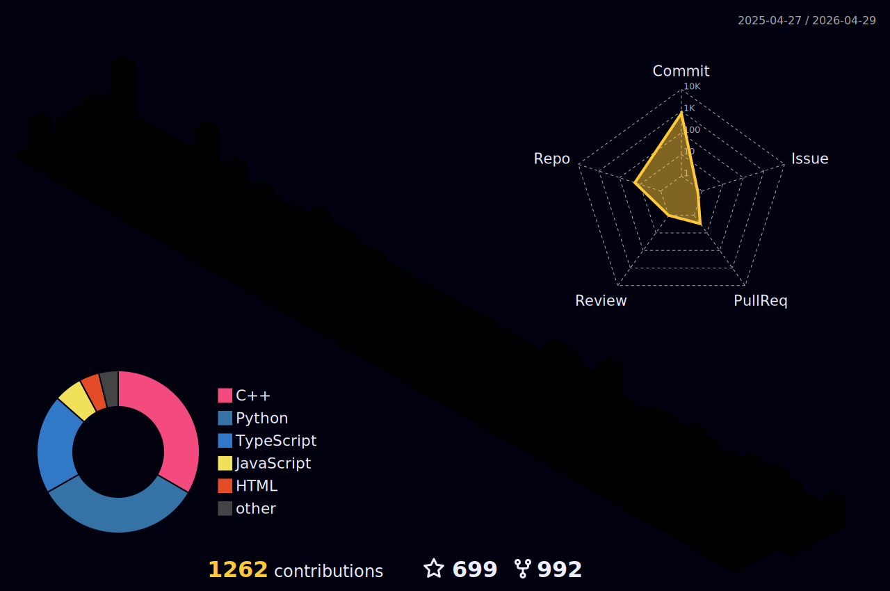

<h1 align="center">
  <a href="https://git.io/typing-svg">
    
  </a>
</h1>


<h3 align="center">An aspirant of Full stack Web Developer</h3>


<!-- Coding GIF: right-aligned -->
<p align="center">
  
</p>

<!-- Typing animation -->
<p align="center">
  
</p>

---

 🚀 **"Building tech with passion, mentoring with love, and dreaming beyond stars..."**

---

### ⚡ About Me

```yaml
Full Name: Arpan Chowdhury
Current Role: Student @ Netaji Subhas Engineering College
Open For: Frontend Internships | Freelance Projects
Internship:
  - 👨‍💼 Wadhwani Foundation
  - 🌐 Websoftrechs PVT. LTD.
  - 🌐 Techno India Group 
  - 🌐 D2 Digi Tech
  - 🌐 Zycruith LLP ( Startup SDE I)
  - 🌐 Springer Capital (Frontend SDE Intern )

Leadership:
  - 👨‍💼 President, GNX (CSE Tech Club)
  - 🧠 Lead, PeerHub x NSEC Student Chapter
  - 🌐 Secretary, IEEE Computer Society NSEC CS Society
Community:
  - 🚀 Lead, NOOBUILD Community
Hobbies:
  - 🎸 Guitarist
  - ✏️ Sketch Artist
  - 🌙 Star Gazer & Universe Traveller 

```

🏆 Achievements
<table> <tr><td>🥇 Winner</td><td>Hack4Bengal 2025 (Eastern India's Biggest Hackathon)</td></tr><tr><td>🥇 TOP 10</td><td>PRAGATI META AI HACKATHON 2025</td></tr><tr><td>🥇 Winner</td><td>Hacksynthesis UEM 2025 </td></tr> <tr><td>🥈 Runners-Up</td><td>NLP Hackathon 2025 – IIT Kharagpur</td></tr><tr><td>🥈 Runners-Up</td><td>SIH Runners UP College 2025</td><tr><td>🥈 TOP 8</td><td>SIH TOP 8 AIR 2025</td></tr> <tr><td>🥉 2nd Runners-Up</td><td>AI Hackathon 2025 – IIT Kharagpur</td></tr> <tr><td>⚡ Runners-Up</td><td>SparkHack 2025 – Jadavpur University</td></tr> <tr><td>🎨 Winner</td><td>Portfolio Design – MuLearn GCEK</td></tr> <tr><td>🔥 Winner</td><td>HackSquad by NOVU (🌍 World Rank #22)</td></tr> <tr><td>🎁 Winner</td><td>Refine.dev Hackathon Raffle</td></tr> <tr><td>🌐 Finalist</td><td>Hack4Bengal 2024,2025 | Smart Bengal Hackathon</td></tr> </table>

```yaml

🌍 Open Source Highlights

✨ Top Project Admin: GSSOC'24 & GSSOC Extended'24
🌟 Top Contributor: SWOC'24 | APERTRE'23
🥇 Top Mentor: JWOC'23
🧠 Project Mentor: OSEN, JWOC'23, CodePeak'23, Hacktoberfest'23, KWOC'23
🌱 Contributor: GSSOC (Rank 85), SSOC'23

```


🧠 My Tech Stack
<div align="center">  </div>

```yaml

💻 Focused on: Frontend, TypeScript, UI/UX

📢 Extra: Digital Marketing, Branding, Web Animations


🎸 Fun Things About Me
🎨 I design interfaces like I sketch ✏️
🎵 I write code with music in my ears 🎧
🌌 I'm a daydreamer with a telescope lens 🔭
🧳 Forever curious & in love with cosmic travel 🚀

```

📫 Let's Connect!
<p align="left"> <a href="mailto:arpanchowdhury003@gmail.com">  </a> 
  <a href="https://www.linkedin.com/in/arpan-chowdhury-775294251/">  </a> 
  <a href="https://github.com/apu52">  </a> </p>

<p align="center">  </p> 


<h3 align="left">🌐 Connect with me:</h3>

<p align="left">
  <a href="https://twitter.com/ArpanCh40193288" target="_blank">
    
  </a>
  <a href="https://www.linkedin.com/in/arpan-chowdhury-775294251/" target="_blank">
    
  </a>
  <a href="https://auth.geeksforgeeks.org/user/arpanchowgrwe/practice" target="_blank">
    
  </a>
  <a href="https://www.youtube.com/channel/UCfizmZAK3iaw6jt6-BTWrUw" target="_blank">
    
  </a>
  <a href="https://www.hackerrank.com/arpanchowdhury02" target="_blank">
    
  </a>
  <a href="https://leetcode.com/ArpanChowdhury/" target="_blank">
    
  </a>
  <a href="https://www.instagram.com/anuragbasu1973/" target="_blank">
    
  </a>
  <a href="mailto:arpanchowdhury003@gmail.com">
    
  </a>
  <a href="https://discord.gg/" target="_blank">
    
  </a>
  <a href="https://www.codechef.com/users/arpan52" target="_blank">
    
  </a>
</p>


<p align="left">
</p>

<h3 align="left">💻 Languages and Tools:</h3>

<p align="left">
  
  
  
  
  
  
  
  
  
  
  
  
  
  
  
  
  
  
  
  
  
  
  
</p>


<div id="header" align="center">
  
</div>

## 💫 Github Stats


<div align="center">
     
</div>


<div align="center">
  
</div>




</div>


<div align=center>
 
  
  
 
</div>

<p></p>


<h3 align="center">Statistics</h3>
<div align="center">
<a href="https://github.com/apu52">


</div>
<br>


<h4 align="left">My Hactoberfest 2022 & 2023 Badges:</h4>


[](https://holopin.io/@arpan001)


# 📊 LeetCode Stats


# ✍️ Random Dev Quote


