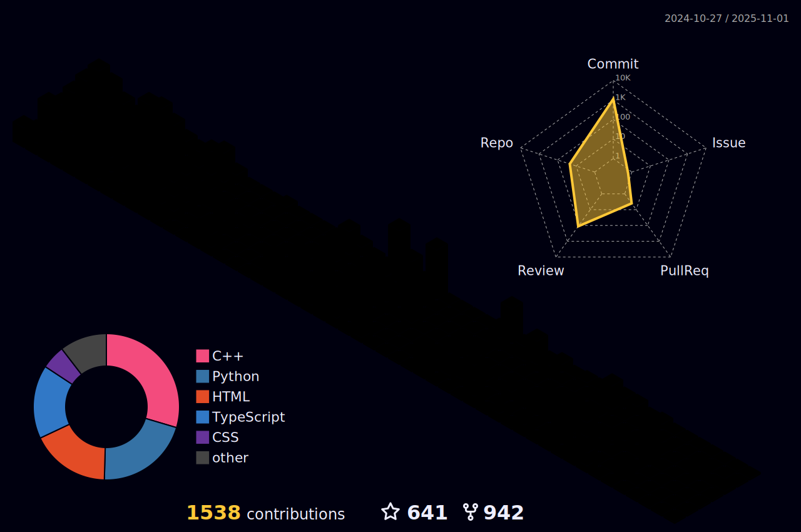

<h1 align="center">
  
</h1>

<h3 align="center">An aspirant of Full stack Web Developer</h3>

  

- I'm now working on **Various front-end projects & on myself**

- 🌱 I’m currently perusing as a student at **Netaji Subhas Engineering College**

- I have participated in two open source contribution programme [GirlScript Summer of Code](https://gssoc.girlscript.tech/) & **SSOC**

- Winner of Portfolio Web design competition organised by MULEARN GCEK 🏆

- 💬 Ask me about **HTML,CSS, Digital Marketing**

- 📫 How to reach me **arpanchowdhury003@gmail.com**

- ⚡ Fun fact **I'm also a Guitarist & sketch drawing enthusiast**

<h3 align="left">Connect with me:</h3>

<h3 align="left">Languages and Tools:</h3>

          

## 💫 Github Stats

<table>    
<tr>
  <td align="center">
    
  </td>
  <td align="center">
    
  </td>
</tr>
</table>

     

<table>    
<tr>
  <td align="center">
    
  </td>
  <td align="center">
     
  </td>
</tr>
</table>

  

  
 <b> ❤️ Github Followers </b> 

    

   

  
 <b> 🦾 Github Achievements </b> 

    

  
 <b> 📆 Github Contribution Calendar </b>

    

<h4 align="left">My Hactoberfest 2022 Badges:</h4>

